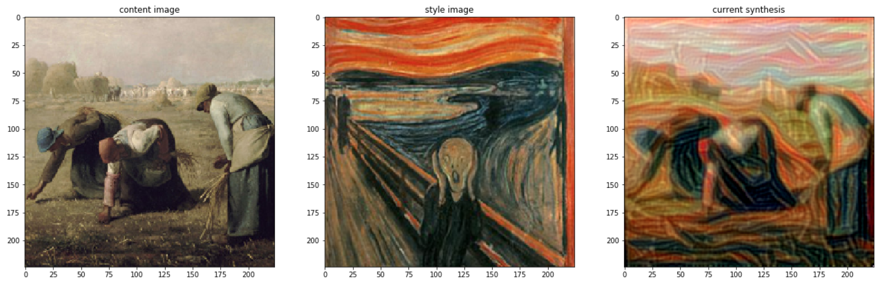

# Style_net
This is a style net with tensorflow

## Method:
Using vgg16 model to get the features from two images ans combine them: one from content features, the other from style features.

## DEMO
## demo: One Earthquake
 

